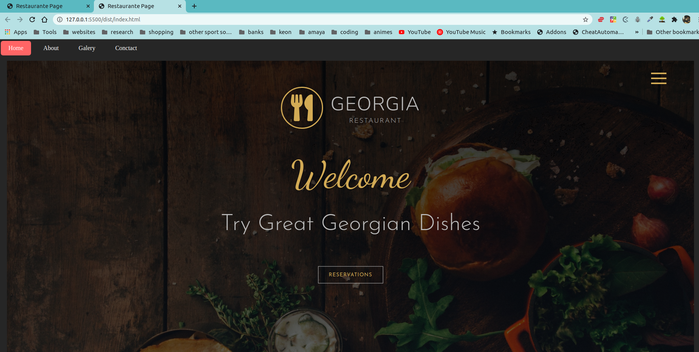

# Restaurante Page

> Project was based on creating a restaurant page using javascript to generate the tabs

## Built With

- Sass
- Webpack
- Npm
- Javascript

## Live Demo

[Live Demo Link](https://rawcdn.githack.com/cvilla714/restaurant-page/4e6e899bba8894e04bb6481fdfec67082086a407/dist/index.html)

## Getting Started

**To get started you can download the code by pressing in the top right corner on the green button**

> To get a local copy up and running follow these simple example steps.

### Prerequisites

- Npm installed on your computer
- Node as well

### Install

> Once you have downloaded the code please open you terminal and paste in this code
> `git clone git@github.com:cvilla714/restaurant-page.git`
> then please run this command to access the correct branch `git checkout work`
> then please run this command to install all of the depencies for the app to run ` npm install`

### Usage

> In order to run the app once you have already installed it please run this comman in your terminal
> `npm run watch`
> then click on the index.html and open it with liver server
> this will open a new browser with the app ready to use.

## Authors

👤 **Cosmel Vilalobos**

- Github: [@cvilla714](https://github.com/cvilla714)
- Twitter: [@kckeyti](https://twitter.com/kckeyti)
- LinkedIn: [Cosmel Villalobos](https://www.linkedin.com/in/cosvilla/)

## 🤝 Contributing

Contributions, issues, and feature requests are welcome!

Feel free to check the [issues page](https://github.com/cvilla714/restaurant-page/pulls).

## Show your support

Give a ⭐️ if you like this project!

## 📝 License

This project is [MIT](https://github.com/cvilla714/restaurant-page/blob/development/LICENSE) licensed.
